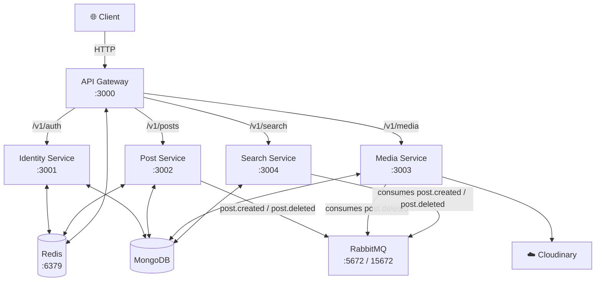

# Social Media Microservices — Project Overview

## 🗺️ Architecture Summary

A **Node.js/Express** microservices backend for a social media platform. All client traffic flows through a single **API Gateway**, which authenticates requests and reverse-proxies them to the appropriate downstream service. Services communicate asynchronously via **RabbitMQ** and use **Redis** for caching and rate-limiting. All services are containerised with Docker and orchestrated via `docker-compose`.



---

## 📦 Modules / Services

### 1. 🔀 API Gateway
**Path:** [api-gateway/](file:///Users/ashutoshsamal/Developer/Code/Projects/social-media-microservices/api-gateway)  
**Port:** `3000`  
**Entry:** [server.js](file:///Users/ashutoshsamal/Developer/Code/Projects/social-media-microservices/api-gateway/src/server.js)

The single entry point for all client requests. Handles cross-cutting concerns before forwarding traffic.

| Concern | Detail |
|---|---|
| **Routing** | Reverse-proxies to downstream services via `express-http-proxy` |
| **Auth** | JWT validation middleware on all protected routes (`/v1/posts`, `/v1/media`, `/v1/search`) |
| **Rate Limiting** | Redis-backed, 100 req / 15 min window (global) |
| **Security** | `helmet`, configurable CORS whitelist |
| **URL rewrite** | `/v1/*` → `/api/*` before proxying |
| **Header injection** | Injects `x-user-id` for authenticated routes |

**Route Map:**

| Gateway Route | Downstream | Auth Required |
|---|---|---|
| `/v1/auth` | Identity Service | ❌ |
| `/v1/posts` | Post Service | ✅ |
| `/v1/media` | Media Service | ✅ |
| `/v1/search` | Search Service | ✅ |

**Key files:**
- [src/middleware/auth.middleware.js](file:///Users/ashutoshsamal/Developer/Code/Projects/social-media-microservices/api-gateway/src/middleware/auth.middleware.js) — JWT verification
- [src/middleware/errorHandler.middleware.js](file:///Users/ashutoshsamal/Developer/Code/Projects/social-media-microservices/api-gateway/src/middleware/errorHandler.middleware.js) — Global error handler
- [src/db/redis/](file:///Users/ashutoshsamal/Developer/Code/Projects/social-media-microservices/api-gateway/src/db) — Redis client
- [src/utils/](file:///Users/ashutoshsamal/Developer/Code/Projects/social-media-microservices/api-gateway/src/utils) — Logger

---

### 2. 🪪 Identity Service
**Path:** [identity-service/](file:///Users/ashutoshsamal/Developer/Code/Projects/social-media-microservices/identity-service)  
**Port:** `3001`  
**Entry:** [server.js](file:///Users/ashutoshsamal/Developer/Code/Projects/social-media-microservices/identity-service/src/server.js)

Manages user accounts, authentication, and JWT token lifecycle.

**API Endpoints (`/api/auth`):**

| Method | Path | Description |
|---|---|---|
| `POST` | `/register` | Create new user account |
| `POST` | `/login` | Authenticate user, return tokens |
| `POST` | `/refresh-token` | Rotate refresh token, issue new access token |
| `POST` | `/logout` | Invalidate refresh token |

**Key files:**
- [src/controllers/identity.controller.js](file:///Users/ashutoshsamal/Developer/Code/Projects/social-media-microservices/identity-service/src/controllers/identity.controller.js) — Auth logic
- [src/models/User.model.js](file:///Users/ashutoshsamal/Developer/Code/Projects/social-media-microservices/identity-service/src/models/User.model.js) — User schema (Mongoose)
- [src/models/RefreshToken.model.js](file:///Users/ashutoshsamal/Developer/Code/Projects/social-media-microservices/identity-service/src/models/RefreshToken.model.js) — Persisted refresh tokens
- [src/utils/generateToken.util.js](file:///Users/ashutoshsamal/Developer/Code/Projects/social-media-microservices/identity-service/src/utils) — JWT generation helper
- [src/utils/validator.util.js](file:///Users/ashutoshsamal/Developer/Code/Projects/social-media-microservices/identity-service/src/utils) — Joi validation schemas

**Security:**
- Passwords hashed with **Argon2**
- Dual-layer rate limiting: global Redis (`RateLimiterRedis`, 10 req/sec) + endpoint-specific (`express-rate-limit`, 50 req/15 min on `/register` & `/login`)
- Access token (short-lived) + Refresh token (long-lived, stored in MongoDB) rotation pattern

---

### 3. 📝 Post Service
**Path:** [post-service/](file:///Users/ashutoshsamal/Developer/Code/Projects/social-media-microservices/post-service)  
**Port:** `3002`  
**Entry:** [server.js](file:///Users/ashutoshsamal/Developer/Code/Projects/social-media-microservices/post-service/src/server.js)

Manages CRUD operations for posts and publishes lifecycle events.

**API Endpoints (`/api/posts`):**

| Method | Path | Description |
|---|---|---|
| `POST` | `/create-post` | Create a new post (rate-limited: 10/15 min) |
| `GET` | `/` | Paginated list of all posts |
| `GET` | `/:id` | Get single post by ID |
| `DELETE` | `/:id` | Delete a post (owner only) |

**Key files:**
- [src/controllers/post.controller.js](file:///Users/ashutoshsamal/Developer/Code/Projects/social-media-microservices/post-service/src/controllers/post.controller.js) — CRUD + cache + event publishing
- [src/models/Post.model.js](file:///Users/ashutoshsamal/Developer/Code/Projects/social-media-microservices/post-service/src/models/Post.model.js) — Post schema (`user`, `content`, `mediaIds`)
- [src/utils/rabbitmq.js](file:///Users/ashutoshsamal/Developer/Code/Projects/social-media-microservices/post-service/src/utils) — RabbitMQ publisher

**Caching strategy (Redis):**
- Individual posts cached for **1 hour** (`post:<id>`)
- Paginated list cached for **5 minutes** (`posts:<page>:<limit>`)
- Cache invalidated on create/delete

**Events published:**
| Event | Payload |
|---|---|
| `post.created` | `postId`, `userId`, `content`, `createdAt` |
| `post.deleted` | `postId`, `mediaIds`, `userId` |

---

### 4. 🖼️ Media Service
**Path:** [media-service/](file:///Users/ashutoshsamal/Developer/Code/Projects/social-media-microservices/media-service)  
**Port:** `3003`  
**Entry:** [server.js](file:///Users/ashutoshsamal/Developer/Code/Projects/social-media-microservices/media-service/src/server.js)

Handles file uploads to **Cloudinary** and maintains media metadata. Also reacts to post deletion events to clean up associated media.

**API Endpoints (`/api/media`):**

| Method | Path | Description |
|---|---|---|
| `POST` | `/upload` | Upload a file (multipart/form-data) |

**Key files:**
- [src/controllers/media.controller.js](file:///Users/ashutoshsamal/Developer/Code/Projects/social-media-microservices/media-service/src/controllers/media.controller.js) — Upload handler
- [src/models/Media.model.js](file:///Users/ashutoshsamal/Developer/Code/Projects/social-media-microservices/media-service/src/models/Media.model.js) — Media schema (`publicId`, `url`, `mimeType`, `originalName`, `userId`)
- [src/utils/cloudinary.util.js](file:///Users/ashutoshsamal/Developer/Code/Projects/social-media-microservices/media-service/src/utils/cloudinary.util.js) — Cloudinary SDK wrapper
- [src/utils/rabbitmq.util.js](file:///Users/ashutoshsamal/Developer/Code/Projects/social-media-microservices/media-service/src/utils/rabbitmq.util.js) — RabbitMQ consumer
- [src/eventHandlers/media-event-handlers.js](file:///Users/ashutoshsamal/Developer/Code/Projects/social-media-microservices/media-service/src/eventHandlers) — Handles `post.deleted` → deletes media from Cloudinary + DB

> [!NOTE]
> The API Gateway uses `parseReqBody: false` for `/v1/media` routes to ensure raw multipart streams are forwarded untouched for file upload.

---

### 5. 🔍 Search Service
**Path:** [search-service/](file:///Users/ashutoshsamal/Developer/Code/Projects/social-media-microservices/search-service)  
**Port:** `3004`  
**Entry:** [server.js](file:///Users/ashutoshsamal/Developer/Code/Projects/social-media-microservices/search-service/src/server.js)

Provides full-text search over posts by consuming events to maintain a search index in MongoDB.

**API Endpoints (`/api/search`):**

| Method | Path | Description |
|---|---|---|
| `GET` | `/` | Search posts by query parameter |

**Key files:**
- [src/controllers/search.controller.js](file:///Users/ashutoshsamal/Developer/Code/Projects/social-media-microservices/search-service/src/controllers/search.controller.js) — Search handler
- [src/models/Search.model.js](file:///Users/ashutoshsamal/Developer/Code/Projects/social-media-microservices/search-service/src/models/Search.model.js) — Denormalized post document for search indexing
- [src/eventHandlers/searchEventHandlers.js](file:///Users/ashutoshsamal/Developer/Code/Projects/social-media-microservices/search-service/src/eventHandlers) — Handles `post.created` (index) and `post.deleted` (remove)
- [src/utils/rabbitmq.util.js](file:///Users/ashutoshsamal/Developer/Code/Projects/social-media-microservices/search-service/src/utils) — RabbitMQ consumer

**Events consumed:**
| Event | Action |
|---|---|
| `post.created` | Insert into search index |
| `post.deleted` | Remove from search index |

---

## 🏗️ Infrastructure Components

| Component | Image | Ports | Role |
|---|---|---|---|
| **Redis** | `redis:alpine` | `6379` | Rate limiting store, response caching |
| **RabbitMQ** | `rabbitmq:3-management` | `5672` (AMQP), `15672` (Management UI) | Async event bus between services |
| **MongoDB** | *(external/Atlas)* | — | Primary data store for all services |
| **Cloudinary** | *(external SaaS)* | — | Object/media storage |

---

## 🛠️ Technology Stack

| Layer | Technology |
|---|---|
| Runtime | Node.js (ESM modules) |
| Framework | Express.js v5 |
| Database ORM | Mongoose v9 |
| Caching | ioredis |
| Message Broker | amqplib (RabbitMQ) |
| Auth | jsonwebtoken, argon2 |
| Validation | Joi |
| Security | helmet, cors |
| Rate Limiting | express-rate-limit, rate-limit-redis, rate-limiter-flexible |
| Logging | winston |
| Containerisation | Docker, docker-compose |
| Media Storage | Cloudinary SDK |

---

## 🔐 Security Overview

| Strategy | Applied In |
|---|---|
| JWT Access Token verification | API Gateway (all protected routes) |
| Refresh Token rotation | Identity Service |
| Argon2 password hashing | Identity Service |
| Redis-backed rate limiting (global) | API Gateway, Identity Service |
| Endpoint-specific rate limiting | Identity `/register`, `/login`; Post `/create-post` |
| Helmet HTTP headers | All services |
| CORS whitelist | All services |
| User ownership check on delete | Post Service |

---

## 📁 Directory Structure

```
social-media-microservices/
├── docker-compose.yml
├── api-gateway/
│   └── src/
│       ├── server.js          # Entry, proxy setup
│       ├── middleware/        # auth, errorHandler
│       ├── db/redis/          # Redis client
│       └── utils/             # logger
├── identity-service/
│   └── src/
│       ├── server.js
│       ├── controllers/       # identity.controller.js
│       ├── models/            # User, RefreshToken
│       ├── routes/            # identity.route.js
│       ├── middlewares/       # globalErrorHandler
│       ├── db/                # MongoDB + Redis
│       └── utils/             # generateToken, validator, logger
├── post-service/
│   └── src/
│       ├── server.js
│       ├── controllers/       # post.controller.js
│       ├── models/            # Post
│       ├── routes/            # post.route.js
│       ├── middlewares/       # globalErrorHandler
│       ├── db/                # MongoDB + Redis
│       └── utils/             # rabbitmq, validator, logger
├── media-service/
│   └── src/
│       ├── server.js
│       ├── controllers/       # media.controller.js
│       ├── models/            # Media
│       ├── routes/            # media.routes.js
│       ├── middlewares/       # globalErrorHandler
│       ├── eventHandlers/     # media-event-handlers.js
│       ├── db/                # MongoDB
│       └── utils/             # cloudinary, rabbitmq, logger
└── search-service/
    └── src/
        ├── server.js
        ├── controllers/       # search.controller.js
        ├── models/            # Search
        ├── routes/            # search.route.js
        ├── middlewares/       # globalErrorHandler
        ├── eventHandlers/     # searchEventHandlers.js
        ├── db/                # MongoDB
        └── utils/             # rabbitmq, logger
```
